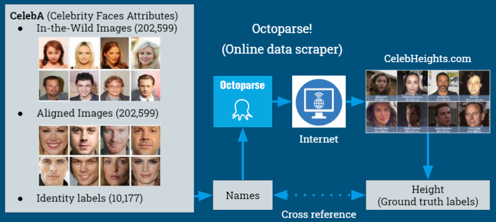
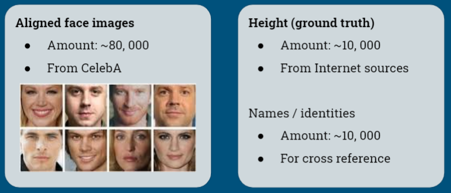

# Face Is All You Need - CMU Spring 2021 Visual Learning & Recognition Final Project
Szu-Yu (Eva) Mo, Szu-Yu (Angela) Lin, Michael Cheng
{szuyum, szuyul, mcheng3}@andrew.cmu.edu
## Abstract
In this project, we have constructed and trained several deep regression models to predict one's height based solely on their facial image. We have also concluded that using the backbone of FaceNet as the image feature extractor followed by three layers of fully connected layers generates the best results. This application could be useful for criminal/suspicious individual identification or even prevent dating app frauds. Possible future works include predicting one's weight, age, or even net-worth based on facial images.
## Presentation Video

## Problem Description
Our motivation includes the following scenarios where a tool to predict one's height based on their facial image would be really helpful.
* **Surveillance**: Occasionally, a surveillance camera would only capture a criminal's or a suspect's face, but not the whole body image, e.g. a robber of a convenience store. Knowing the height of a criminal is critical for police investigation. A tool able to infer the height of the person from the surveillance footage might be able to help reduce crime rates.
* **Prevent dating app fraud**: The foring of physical information (height, wieght, age) on dating profiles have been an issue ever since dating apps became popular in the early 2010s. If a tool embedded in the app could predict one's height based headshots, it could inform it's possible matches of fraud. Ideally, this sort of tool could decrease the frequency of people lying on dating apps.
* **Zoom meeting**: Ever since the course 16824 started, we have been very curious about the height of our professors, [Abhinav](https://scholar.google.com/citations?user=bqL73OkAAAAJ&hl=zh-TW&oi=ao) and [Deepak](https://scholar.google.com/citations?user=AEsPCAUAAAAJ&hl=zh-TW&oi=ao). Since all we could see is the facial images through Zoom meetings, we decided that we have to invent a tool that could tell a person's height solely from the face we see in a Zoom classroom. Besides, remote working and collaboration have gradually become the norm. It is no exaggeration to say that people might not see each other in person from the start to the end of an entire project. Knowing a little bit about your partner might just help bridge the gap between social life and advanced technology slightly in these trying times.

Due to the abovementioned scenarios, we would like to build this tool that takes in a facial image as input and output a height prediction.

## Literature Review
### Body attributes estimation
In recent days, there are many research topics related to inferring human body information from images. There are networks that predicts one's height based on facial images and body shapes[1], estimates one's height, weight and BMI from single-shot facial images[2]. There is also a computational approach that tells the human BMI from facial features[3] and a model that tells one's weight based on several body shape attributes[4].

### Face recognition
Face recognition is also a popular research topic, such as identity classification [5], or pedestrian tracking / re-identification [6]. 
**Training instances** One of the simpler methods is to train on cropped and aligned facial images, while other approaches challenge to train on unaligned images and either generalize or learn a transformer during the training process. Some methods also involve face detection and partial pooling of features.
**Loss functions and metrics** For face identification, a common approach is to train on a large-scale dataset with a large number of classes, where each class represents a different identity. Cross Entropy loss is commonly the designated loss function, which attempts to maximize the class probability on the correct class/identity.
On the other hand, for cases that we do not expect all identities to be in the data, metric learning would be more suitable. The output of each face image is a feature vector instead of a set of class probabilities, and we can compute the "distance" between two feature vectors to determine whether they are the same identity. This could be applied for surveillance, re-identification or tracking purposes. Different from classification methods, loss functions generally used here are Siamese loss (tries to minimize distance between instances of the same class) and Triplet loss (additional to Siamese loss, it as well maximizes the distance between instances of different classes).
**Pretrained features** In either approach above, feature extraction networks pretrained on large datasets will encode lots of information about human faces, especially important facial features. Therefore, face recognition-related networks will be a good choice as the backbone/feature extractor for our task.

## Approach & Challenges
### Data Acquisition

We sought out to find a face-height dataset that suits our needs. However, there wasn't such an open source dataset present online. We decided to find a decent set of human face images first, then label the faces with their corresponding height.

In order to find the height labels for the people in the image dataset, we couldn't simply use any random facial image dataset, since acquiring the height of these subjects would be impossible. We needed a dataset where the subjects are well-known figures whose heights are obtainable. Hence, we chose the Large-scale CelebFaces Attributes (CelebA) Dataset [7]. The CelebA dataset contains 10,177 different celebrities and 202,599 face images, with each image labeled with numerous attributes such as the celebrity's name, gender, has a beard or not, etc... These images are all roughly aligned using similarity transformation according to the two eye locations, thus for all the facial images, the eyes are all warped to the same location.

*Figure: Facial Images in the CelebA Dataset Aligned Roughly About the Eyes*

The next step was to find the height labels of these faces. The website celebheights.com has the height information of 13059 celebrities. It would be an arduous task if we were to manually record and label these heights to the CelebA dataset, thus we use the tool OctoParse to automatically parse the whole website into a list of celebrity name - height pairs. Since we had the image - celebrity name pair on the CelebA side and the celebrity name - height pair on the other, we wrote a script to match this information together. In the end we were able to get the height data of 3671 celebrities and 82453 images in the CelebA dataset, a decent amount to train a network. 

The "Show me your face and I will tell you your height, weight, and body mass index" [2] research also had a celebrity face and labeled height dataset of size 1026, and we were able to contact the author to acquire it. Although the dataset isn't large compared to what we already have, we still added these image - height pairs to our data.

*Figure: Our data collection and matching method.*

*Figure: Our generated dataset.*

### Neural Network Overview
Our neural network consists of two parts, the pretrained backbone and the classifier. The classifier is composed of several linear layers, of which the last layer has only one output neuron. The overall network architecture is shown in the diagram below.
During both training and testing phases, we pass the aligned, augmented face images through the pretrained backbone, followed by the classifier. The final layer of the classifier produces a scalar "score", which is actually the height prediction of the person in the input image. 
After having the height prediction of an instance, we compare it to the ground truth height, and use the mean square error (MSE) as our loss function:

$loss = \frac{1}{N}\sum_{n=1}^N(y_n - \hat{y}_n)^2$

*Figure: Pipeline of our neural network.*

### Pretrained Backbones
* **VGG16 and ResNet**
Initially, we used popular image feature embedding network architectures as our pretrained backbone. We tried with the pretrained VGG16 and Resnet18 in Pytorch, which are both pretrained on the ImageNet dataset. The trained model results in about 3% error during validation, which we suspect it is due to the image category that the network was pretrained on. We intend to get facial features from this upstream network while the network is pretrained on ImageNet which contains mostly random objects and scenery.

* **VGGFace2**
Besides using the standard VGG and ResNet architectures, which were trained on large scale images of common objects, we also used VGGFace2 [5], which is based on the Inception Resnet architecture, but trained on cropped face images instead, in order to perform identity classification. 
VGGFace2 is also utilized in related applications, such as face recognition [6] and pedestrian re-identification. This publication proposes FaceNet, which consists of MTCNN, face region detector, and VGGFace2, which acts as the feature embedder for the detected face regions. This network has proven to outperform VGG16 and ResNet as the mean square error in validation set is less and the accuracy is higher.

*Figure: Example of FaceNet Face Recognition.*

### Implementation Details

* **Data Preprocessing**
In order to make the model learn better from the labels, we preprocessed the heights by converting the numbers to centimeters and normalizing them with the mean(172.24 cm) and standard deviation(10.03) computed from the training dataset. During the validation or testing phase, we denormalize the prediction from the model with the same mean and standard deviation. 
For image preprocessing, we applied augmentation on the training set, including random grayscale and random horizontal flip. We also tried random cropping which worsened our performance, probably due to the images aligned about the eyes.

* **Network architecture**
Input images are resized to $3\times224\times224$ in our implementation. 
For our neural network classifier, we use a sequence of linear layers with 128, 10, and 1 neurons respectively, each followed by a batch normalization layer, a ReLU activation, and a dropout layer with probability 0.4, except for the final layer.

* **Training**
The optimizer that produced the best results on our validation set is SGD (Stochastic Gradient Descent), with a learnaing rate of 0.01 and momentum of 0.9. We trained the model for 30 epochs with batch size 32.

## Evaluation & Results
### Saliency maps
Saliency map analysis is to visualize the gradients of the back-propagated losses of all spatial locations of the input image, in order to determine locations with larger gradients, or in other words, to figure out what does the network focuses on.
We compared saliency maps from both VGG and FaceNet/VGGFace2 backbones, with our original photos, in the following figure. 
From the results we can observe that the VGG saliency maps tend to overlap with the "brighter" areas in the image, this is probably because it was trained on and aiming to generalize across a large variety of images. 
On the other hand, the FaceNet, which is trained on facial images, produces saliency maps that are able to capture the entire contour of the person in the image (head, hair, etc.) and have the largest gradients on significant facial characteristics (such as the nose or mouth). This shows that FaceNet better encodes and is more aware of facial features.

*Figure: Comparison between original images (left), \
saliency maps from VGG (center) and FaceNet (right).*

### Prediction Results
The following table shows the training loss and validation accuracy after training for 30 epochs.

| Upstream Network | Training Loss | Validation Accuracy |
|-------|---------------|---------------------|
| VGG16 | 0.56 | 96.5% |
| VGGFace2 | 0.50| 96.7% |

*Table 1: Traning loss & accuracry across differnet networks*

## Conclusion & Future Work
Our trained network is able to predict one's height with an acceptable accuracy (roughly +/- 2 inches). Although we could not reach near-perfect accuracy, the predictions could serve as a reference whenever the height information is required but absent.
To fulfill our motivation, we look forward to predicting one's weight, age, and net-worth based on facial images as well. This will give us a more complete estimation of a person covering all attributes, which could be benificial in numerous investigation and research scenarios.
For our future work, we hope to train on the "in-the-wild" portion of the CelebA dataset (which are not cropped nor specifically aligned), aiming for better generalization, and also consider the possible clues encoded in other visible body parts.
An observation we had on the dataset is that the majority of the subjects are Caucasian, therefore, our model tends to be more accurate when predicting the height of Caucasian identities, and are at times slightly inaccurate when predicting heights of other races. [9] states that models trained on biased datasets tend to encode and amplify those biases, and eventually affecting the outcome. 
Therefore, another future goal of ours, is probably to train the model on a dataset more balanced across race, gender, and other attributes, such as use some methods that [9] proposed. 

## References
[1] S. Gunel, H. Rhodin, P. Fua, “What Face and Body Shapes Can Tell About Height”, Conference on Computer Vision and Pattern Recognition (CVPR), 2019.
[2] A. Dantcheva, P. Bilinski, F. Bremond, "Show me your face and I will tell you your height, weight and body mass index," Proc. of 24th IAPR International Conference on Pattern Recognition (ICPR), (Beijing, China), August 2018.
[3] L. Wen, G. Guo, “A computational approach to body mass index prediction from face images”, Image and Vision Computing, 2013.
[4] C. Velardo; J. Dugelay, “Weight estimation from visual body appearance”, IEEE International Conference on Biometrics: Theory, Applications, and Systems (BTAS), 2010.
[5] Q. Cao, L. Shen, W. Xie, O. M. Parkhi, A. Zisserman, “VGGFace2: A Dataset for recognising faces across pose and age”, Conference on Computer Vision and Pattern Recognition (CVPR), 2018.
[6] F. Schroff, D. Kalenichenko, J. Philbin, “FaceNet : A Unified Embedding for Face Recognition and Clustering”, Conference on Computer Vision and Pattern Recognition (CVPR), 2015.
[7] Z. Liu, P. Luo, X. Wang, X. Tang, “CelebA:Large-scale CelebFaces Attributes (CelebA) Dataset”, Proceedings of International Conference on Computer Vision (ICCV), 2015.
http://mmlab.ie.cuhk.edu.hk/projects/CelebA.html
[8] https://www.celebheights.com/
[9] J. Zhao, T. Wang, M. Yatskar, V. Ordonez, K. Chang, “Men Also Like Shopping: Reducing Gender Bias Amplification using Corpus-level Constraints”, Proceedings of Conference on Empirical Methods in Natural Language Processing (EMNLP), 2017.
